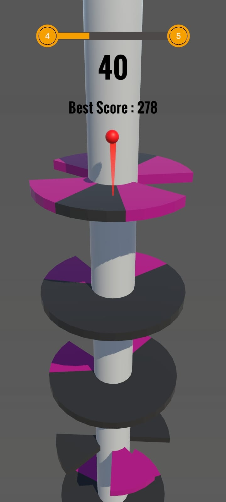
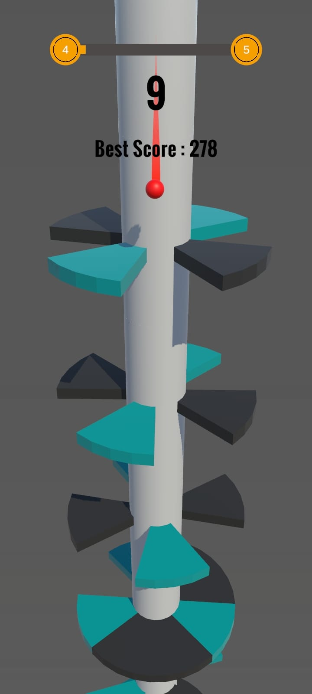
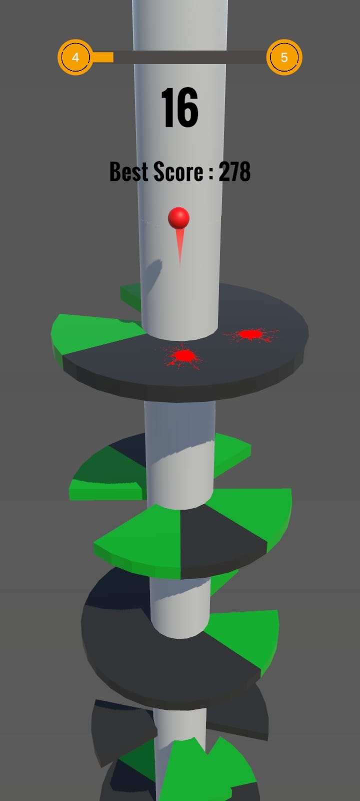
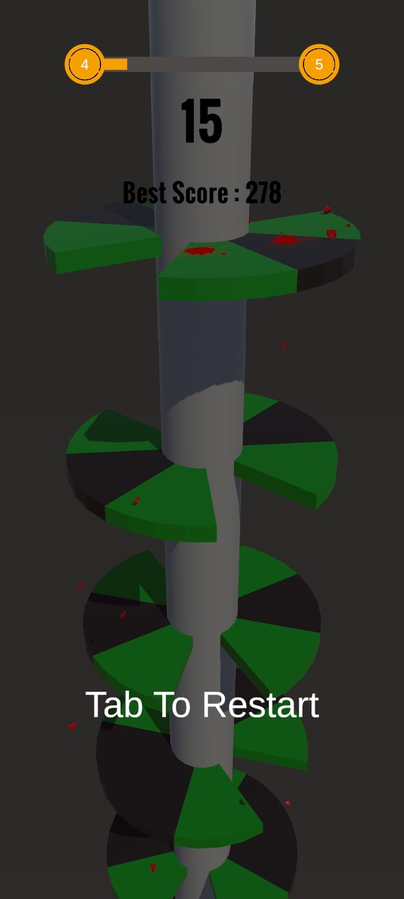

# Unity Helix Jump

Bu proje, Unity kullanılarak mobil cihazlar için geliştirilen bir **Hyper Casual** oyunudur. Oyuncular, topu döndürerek platformlardan aşağıya doğru sektirip hedefe ulaşmaya çalışır. Basit ama bağımlılık yaratan mekanikleriyle keyifli bir oyun deneyimi sunar.

## Özellikler

- **Basit Kontroller**: Dokunmatik ekran desteği ile kolay oynanış.
- **Eğlenceli Fizik Mekanikleri**: Topun zıplama ve düşme hareketleri gerçekçi bir şekilde simüle edilmiştir.
- **Dinamik Seviyeler**: Her seviye farklı engeller ve zorluklarla gelir.
- **Minimalist Grafikler**: Sade ve renkli bir görsel tasarım.
- **Hedef Odaklı Oynanış**: Oyuncuların hedefe ulaşmak için stratejik düşünmesi gerekir.

## Nasıl Oynanır?

1. Oyuncu, ekrana dokunarak veya kaydırarak platformları döndürür.
2. Topu boşluklardan geçirerek aşağıya doğru ilerletir.
3. Topu engellere çarpmadan hedefe ulaştırmaya çalışır.
4. Hedefe ulaşıldığında bir sonraki seviyeye geçilir.
5. Engellere çarptığında oyun sona erer.

## Gereksinimler

- **Unity Sürümü**: 2021.3 veya üzeri
- **Platformlar**: Android ve iOS
- **Geliştirme Ortamı**: Unity Editor

## Kullanılan Teknolojiler

- **Unity Engine**: Oyun geliştirme.
- **C# Scriptleri**: Oyun mekaniği ve iş mantığı.
- **Unity Physics**: Topun fizik davranışlarını oluşturmak için.
- **Unity UI**: Arayüz tasarımı ve oyun içi geri bildirimler.

## Görseller

  
  

  
  

## Lisans

Bu proje, [MIT Lisansı](LICENSE) kapsamında lisanslanmıştır.
